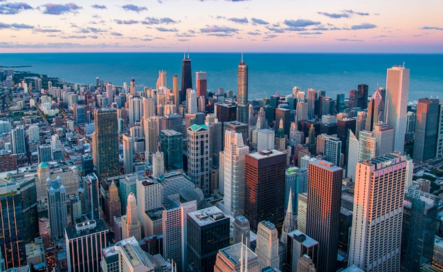
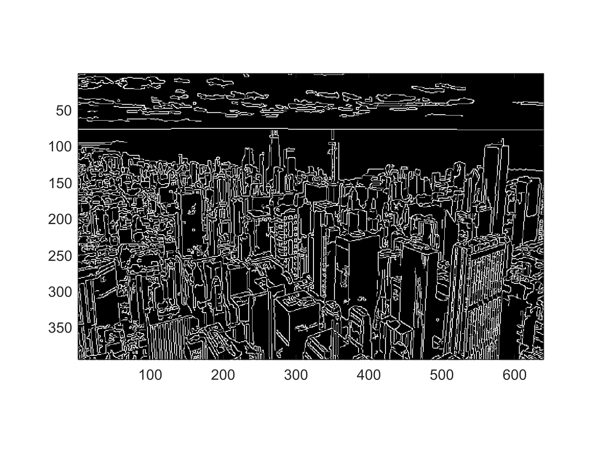

# L'algoritmo di Canny
Lo scopo di questo progetto è individuare i bordi presenti in un'immagine, ovverosia i contorni delle figure che sono rappresentate nell'immagine, mediante
implementazione dell'algoritmo di Canny.
L'idea chiave dell'algoritmo è quella di andare a confrontare la velocità di variazione del colore in pixel contigui, se c'è una variazione di colore molto
intensa in 3 pixel contigui, l'algoritmo di Canny catalogherà il pixel centrale come di bordo.  
L'algoritmo prende il nome da John Canny, autore dell'articolo *A Computational Approach to Edge Detection* pubblicato nel 1986. 
Nel presente progetto ne viene realizzata una versione con filtro gaussiano, operatori di Sobel, soppressione dei non massimi e doppia sogliatura con isteresi.  
I codici sono stati implementati in linguaggio MATLAB, tuttavia, essendo tutti gli algoritmi stati scritti from scratch (da zero) utilizzando unicamente la 
libreria standard di MATLAB, i codici risultano compatibili sia con le licenze base di MATLAB (senza la necessità di specifici toolbox a pagamento), 
sia con il software open-source GNU Octave.  

  
  

## La rappresentazione delle immagini ed il formato di input

Un'immagine raster è individuata da una griglia rettangolare di pixel, ovverosia da una matrice di pixel. 
In seguito indicheremo con $R$ il numero delle righe e con $C$ il numero delle colonne, ed il numero totale di pixel dell'immagine sarà pertanto $R \cdot C$.  
Nelle immagini in scala di grigi ad 8 bit, ciascun pixel sarà un valore compreso tra 0 e 255 (ovverosia $2^8-1$), dove 0 indica il colore nero, 255 indica 
un bianco acceso, e tutti gli interi intermedi individuano una tonalità di grigio, più scuro quando il valore è vicino allo zero e più chiaro 
quando l'intero è vicino a 255.
Per le immagini a colori invece, ciascun pixel della matrice individua una terna di elementi, corrispondenti alla tonalità dei colori Red, Green e Blue, 
motivo per cui queste immagini vengono dette in scala di colori RGB, dal momento che ciascun pixel avrà un colore dato dalla combinazione lineare
di questi tre colori. Segue pertanto che un'immagine in scala di grigi è individuata da una matrice di dimensione $R \times C$, mentre un'immagine a colori 
sarà un array (o tensore) di dimensione $R \times C \times 3$.  
L'immagine output con i bordi sarà invece un'immagine in bianco e nero, dove i pixel assumeranno solo i valori 0 oppure 255.  
Si osservi che nel caso di immagini RGB a valori in `uint8`, ciascun pixel non è rappresentato con 8 bit, bensì con 24, poiché serviranno 8 bit a 
determinare l'intensità di colore su ciascuno dei 3 canali.

La lettura è affidata alla funzione `imread`. Tra i formati più diffusi utilizzabili, purché il contenuto rispetti la rappresentazione appena 
descritta, figurano:

| Formato | Estensioni comuni |
| --- | --- |
| PNG | `.png` |
| JPEG | `.jpg`, `.jpeg` |
| TIFF | `.tif`, `.tiff` |
| BMP | `.bmp` |

La sola estensione del file non è sufficiente a garantire che l'immagine sia adatta al codice: immagini indicizzate mediante una tavolozza, immagini CMYK o immagini a $16$ bit per canale richiedono una conversione preliminare in scala di grigi o RGB a $8$ bit per canale. Il programma non elabora separatamente la trasparenza.

## L'idea dell'algoritmo e la successione delle procedure

L'algoritmo di Canny lavora con un'immagine in scala di grigi, pertanto, se l'immagine è a colori, bisogna innanzi tutto convertirla.  
Preso atto di ciò, l'idea chiave è individuare i punti nei quali l'intensità dell'immagine cambia più rapidamente, e per farlo si utilizzano tecniche alle
derivate discrete ed alle differenze finite, misurando quanto rapidamente cambia l'intensità di pixel vicini.  
Tuttavia, prima di poter procedere effettivamente al calcolo dei gradienti, bisogna dapprima attenuare il rumore visivo presente nella figura: 
l'immagine così com'è può produrre variazioni locali molto forti, di conseguenza, bisogna prima applicare un filtro gaussiano che medi l'intensità di un pixel con quella dei pixel ad esso vicini.

Si calcolano quindi la norma e la direzione del gradiente in ogni pixel, si selezionano i massimi locali lungo tale direzione; questi pixel saranno
i candidati punti di bordo e costituiranno un insieme da cui poi verrà estratto il sottoinsieme dei pixel effettivamente di bordo. 
Determinato l'insieme dei candidati di bordo, si classificano poi i pixel selezionati mediante due soglie suddividendoli in *bordi deboli* e *bordi forti*, 
oppure scartandoli e non considerandoli più come di bordo. 
Infine, si utilizza l'analisi delle componenti connesse tra i pixel per decidere quali bordi deboli conservare e quali scremare ulteriormente.

Lo script principale [Canny.m](./Canny.m) richiama le sette funzioni secondarie nel seguente ordine:

| Ordine | Procedura secondaria | Ruolo |
| --- | --- | --- |
| 1 | [`converti_in_scala_di_grigi`](./Funzioni_Secondarie/converti_in_scala_di_grigi.m) | Convertire, se necessario, l'immagine in scala di grigi |
| 2 | [`smoothing_gaussiano`](./Funzioni_Secondarie/smoothing_gaussiano.m) | Attenuare il rumore mediante un filtro gaussiano. |
| 3 | [`calcola_grad_e_angolo`](./Funzioni_Secondarie/calcola_grad_e_angolo.m) | Stimare la norma del gradiente e quantizzarne la direzione. |
| 4 | [`individua_candidati_massimi`](./Funzioni_Secondarie/individua_candidati_massimi.m) | Selezionare i pixel che abbiano gradiente in norma maggiore dei pixel ad esso adiacenti lungo la direzione data dall'angolo. |
| 5 | [`calcola_soglie`](./Funzioni_Secondarie/calcola_soglie.m) | Determinare due variabili soglia: soglia alta e soglia bassa. |
| 6 | [`individua_bordi_deboli_e_forti`](./Funzioni_Secondarie/individua_bordi_deboli_e_forti.m) | Distinguere bordi forti, bordi deboli e pixel da scartare. |
| 7 | [`gestisci_bordi_deboli`](./Funzioni_Secondarie/gestisci_bordi_deboli.m) | Promuovere i bordi deboli connessi ai bordi forti. |

Al termine della procedura, la matrice `I_bordi` sarà a valori nell'insieme binario $\\{0,255\\}$.  
Le procedure secondarie nella tabella sopra verranno approfondite nelle sezioni sottostanti.

## Conversione in scala di grigi

La funzione [converti_in_scala_di_grigi](./Funzioni_Secondarie/converti_in_scala_di_grigi.m) ha il compito di trasformare un'immagine RGB di dimensioni 
$M \times N \times 3$ in una immagine in scala di grigi di dimensioni $M \times N$.  
Se l'immagine passata alla funzione è già in scala di grigi, la funzione termina senza modificare l'immagine input.

Per trasformare un'immagine da colori in scala di grigi si combinano linearmente i tre colori Red, Green e Blue, utilizzandoli come se fossero dei 
"colori primari".

$$
I_{\mathrm{grigio}}(i,j) = 0.2989 \cdot R(i,j) + 0.5870 \cdot G(i,j) + 0.1140 \cdot B(i,j).
$$

Il motivo per cui si usano proprio questi pesi nella combinazione lineare discende dalla fisica ottica e dal modo in cui l'occhio umano legge le
frequenze di colore

Il risultato della combinazione viene infine convertito a valori `uint8` mediante casting, arrotondando i valori ai livelli interi di grigio rappresentabili, 
la matrice viene infine restituita alla funzione chiamante.

[INSERIRE CONFRONTO IMMAGINE CONVERTITA IN SCALA DI GRIGI]

## Riduzione del rumore mediante filtro gaussiano

La funzione [smoothing_gaussiano](./Funzioni_Secondarie/smoothing_gaussiano.m) attenua le variazioni locali più rapide dell'immagine prima che vengano calcolate le derivate.

Questa fase è necessaria perché le operazioni di derivazione sono sensibili al rumore: una piccola irregolarità tra pixel vicini può produrre un gradiente elevato ed essere interpretata come un bordo. Il filtraggio sostituisce quindi l'intensità di ciascun pixel con una media pesata delle intensità dei pixel circostanti, i
pesi sono dati dalla funzione densità della distribuzione gaussiana.

Il modello di riferimento è la funzione gaussiana bidimensionale:

$$
f_{\sigma}(x,y) = \frac{1}{2\pi\sigma^2}
\exp\left(-\frac{x^2+y^2}{2\sigma^2}\right)
$$

Il filtro gaussiano viene applicato mediante convoluzione dell’immagine in scala di grigi con una maschera $5 \times 5$. I valori della maschera si 
ottengono campionando la funzione gaussiana e normalizzando i pesi affinché la loro somma sia uguale a 1.

Il parametro $\sigma$ regola la distribuzione dei pesi. Valori piccoli concentrano maggiormente il peso vicino al pixel centrale; aumentando $\sigma$, i 
pixel circostanti acquistano maggiore importanza e l'effetto di sfocatura diventa più marcato, con una possibile perdita dei dettagli più fini.  
La variabile `sigma` è uno dei tre parametri modificabili che determinano la distribuzione ed il numero di pixel classificati "di bordo" nella matrice finale. 

Come dettaglio implementativo si segnala che la matrice originale viene espansa di una cornice di contorno dallo spessore di 2 pixel per permettere la convoluzione anche sui pixel nella cornice della foto originaria. La tecnica è quella del *padding* ed i pixel nuovi avranno la stessa intensità del pixel originario ad esso adiacente.

[INSERIRE IMMAGINI CON BLUR GAUSSIANO]

[INSERIRE IMMAGINI IN CUI CONFRONTO OUTPUT DUOMO CON DUE \SIGMA DIVERSI]

## Calcolo della norma e della direzione del gradiente

La funzione [calcola_grad_e_angolo](./Funzioni_Secondarie/calcola_grad_e_angolo.m) utilizza l'immagine filtrata per stimare, in ogni pixel, il gradiente
dell'intensità dell'immagine e l'angolo di tale vettore gradiente. L'obiettivo è stimare intensità e direzione della variazione del colore in scala di grigi.  
Detta $I = I(i,j)$ la matrice descrivente l'immagine (con blur gaussiano), per ogni pixel bisognerà quindi stimare:

$$
\nabla I(i,j) = \begin{pmatrix}
\frac{\partial I}{\partial x}(i,j), \hspace{0.1cm}
\frac{\partial I}{\partial y}(i,j)
\end{pmatrix}.
$$

e per calcolare le derivate si possono usare differenze finite per la derivata prima al secondo ordine di accuratezza:

$$
\frac{\partial I}{\partial x}(i,j) \approx \frac{ I(i,j+1) - I(i,j-1) }{2}
$$

in realtà, si coinvolgono nel calcolo gli altri pixel dell'intorno $3 \times 3$, al fine di rendere il metodo più robusto, e così, 
per stimare $\frac{\partial I}{\partial x}(i,j)$ si usano anche le righe sopra e sotto, andando a computare poi una media pesata dove la riga del 
pixel in questione pesa $2$ e le righe sovrastanti e sottostanti pesano $1$, si ottiene dunque che:

$$
4 \cdot \frac{\partial I}{\partial x}(i,j) \approx \frac{\partial I}{\partial x}(i-1,j) + 2 \cdot \frac{\partial I}{\partial x}(i,j) + 
  \frac{\partial I}{\partial x}(i+1,j)
$$

e di conseguenza, a meno di un fattore moltiplicativo, per stimare la derivata in $\partial x$ di tutti i pixel di $I$ è sufficiente eseguire una convoluzione 
della matrice $I$ con una maschera $K_x$ detta filtro di Sobel, dove la maschera in questione vale:

$$
K_x =
\begin{pmatrix}
-1 & 0 & 1 \\
-2 & 0 & 2 \\
-1 & 0 & 1
\end{pmatrix}
$$

Discorso analogo vale per la stima di $\frac{\partial I}{\partial y}$ dove si userà un filtro di Sobel con maschera:

$$
K_y =
\begin{pmatrix}
1 & 2 & 1 \\
0 & 0 & 0 \\
-1 & -2 & -1
\end{pmatrix}
$$

Note le componenti $x$ ed $y$ del vettore gradiente, è possibile stimare la norma del gradiente con il teorema di Pitagora 
ed è possibile stimare l'angolo $\theta$ del gradiente con la funzione arcotangente, più precisamente tramite la funzione `atan2`, che a differenza 
dell'arcotangente classico ha immagine in $[- \pi, \pi]$, anziché in $\left(-\frac{\pi}{2},\frac{\pi}{2} \right)$, ed implementa nativamente la divisione per 
zero, oltre che la gestione dell'edge-case dell'angolo del vettore nullo.  
Noto $\theta \in [- \pi, \pi]$ lo si approssima ad uno dei $4$ valori: $\\{0^\circ, 45^\circ, 90^\circ, 135^\circ \\}$, in base 
a questo valore si ragionerà in seguito in orizzontale, in verticale, oppure su una delle due diagonali nell'intorno $3 \times 3$ del pixel in esame.

L'output di questa funzione sono le due matrici `Norm_Grad` e `angolo`, entrambe della stessa dimensione $R \times C$ della matrice $I$, contenenti la
prima la norma dei gradienti di ogni pixel e la seconda l'angolo (già quantizzato) del gradiente di ogni pixel. 

## Individuazione dei candidati mediante soppressione dei non massimi

La funzione [individua_candidati_massimi](./Funzioni_Secondarie/individua_candidati_massimi.m) seleziona i pixel che costituiscono massimi locali della norma 
del gradiente lungo la direzione del gradiente stesso. Questa operazione viene detta *non-maximum suppression*, ovverosia soppressione dei non massimi. I 
pixel selezionati saranno i candidati punti di bordo, da cui poi si estrarrà (nelle procedure successive) il sottoinsieme degli effettivi pixel di bordo.
Per ogni pixel $(i,j)$, si accederà innanzi tutto alla direzione contenuta in $\theta(i,j)$, e nota tale direzione si confronterà, nell'intorno $3 \times 3$ 
la norma del gradiente del pixel in esame con quella dei suoi pixel adiacenti lungo la direzione indicata da $\theta(i,j)$, in particolare:  
- pixel sinistro e destro se $\theta(i,j) = 0^ \circ$,
- pixel sopra e sotto se $\theta(i,j) = 90^ \circ$,  
- pixel sulla diagonale da in basso a sinistra ad in alto a destra (antidiagonale) se $\theta(i,j) = 45^\circ$,
- pixel sulla diagonale da in basso a destra ad in alto a sinistra (diagonale principale) se $\theta(i,j) = 135^\circ$.  

Se il pixel ha gradiente in norma strettamente maggiore di uno dei suoi vicini e maggiore o uguale alla norma dell'altro, allora lo si considera un candidato 
punto di bordo. Si evita invece di considerare bordo il caso in cui un pixel abbia gradiente in norma strettamente uguale ad entrambi i suoi pixel adiacenti.  

L'output di questa funzione sarà la matrice `I_bordi` a valori nell'insieme binario $\\{0,255 \\}$ dove un pixel viene messo a $0$ se non è un candidato 
bordo e viene invece messo a $255$ se è un candidato bordo. 

## Calcolo della soglia alta e della soglia bassa

La funzione [calcola_soglie](./Funzioni_Secondarie/calcola_soglie.m) determina i due valori che saranno utilizzati per classificare i candidati.
Una sola soglia imporrebbe una scelta piuttosto rigida: una soglia alta eliminerebbe anche i tratti meno evidenti dei contorni, mentre una soglia bassa 
conserverebbe molte variazioni poco significative. La doppia soglia permette invece di separare i pixel considerati abbastanza marcati da essere conservati 
direttamente da quelli per i quali sarà necessario valutare anche la connessione con gli altri bordi.

